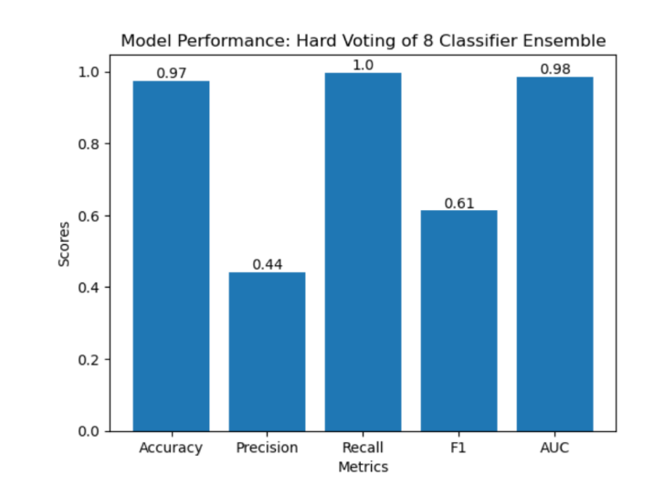

# CPSC483 URL Classifier
 This is our class project for CPSC 483: Introduction to Machine Learning. The objective of this project is to employ machine learning techniques in the field of cybersecurity with the aim of developing a classifier system capable of distinguishing between legitimate and malicious URLs.

## Datasets Used:
NOTE: Raw dataset files are not included in this repository, as it is too large to commit. However, you can download these data sets in the links below and place these files in the `/Dataset` folder before running these notebooks.

 - Dataset of Malicious and Benign Webpages: https://data.mendeley.com/datasets/gdx3pkwp47/1
 - 7+ Million Company Dataset: https://www.kaggle.com/datasets/peopledatalabssf/free-7-million-company-dataset?resource=download 

## Machine Learning Algorithms: 

 This project utilizes 4 machine learning algorithms: K-nearest neighbors, decision trees, random forests, and Naive Bayes. Each model was trained on the Dataset of Malicious and Benign Webpages (See above) both trained on full and reduced feature sets, creating a total of 8 models. We've combined all 8 models together to perform hard classification (Classifying based on majority votes).

 So far, these are our results when measuring this system based on accuracy, precision, recall, F1-Score, and AUC:

To learn more, check out our research paper: 